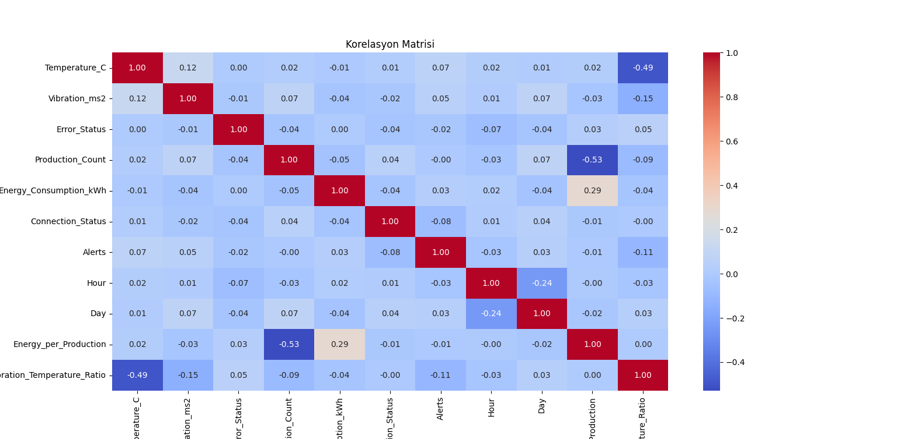

# 🌟 IoT Veri Seti Analizi

Bu proje, bir fabrikadaki makinelerden IOT ile alınan veri setinin makine öğrenmesi teknikleri kullanılarak analiz edilmesini kapsamaktadır. Analiz; veri önişleme, keşfedici veri analizi, görselleştirme, model eğitimi ve değerlendirme adımlarını içerir. Sonuçlar, bir fabrikadaki enerji tüketimi, hata tahmini ve makine uyarıları hakkında öngörüler sağlamaya yöneliktir.

&nbsp;


## 🎯 Amaçlar
- Veri Analizi: Veri setini makine öğrenmesi için temizlemek ve önişlemek.
- Model Eğitimi: Sınıflandırma (hata tahmini gibi) ve regresyon (enerji tüketimi tahmini gibi) için modeller eğitmek.
- Görselleştirme: Veri hakkında görsel çıkarımlar sağlamak.
- Değerlendirme: Uygun metriklerle model performansını değerlendirmek.
- Döküman Hazırlama: Tüm süreci, kodu ve sonuçları net bir şekilde açıklamak.


&nbsp;


## 📊 Veri Seti

### Açıklama
Veri seti, bir fabrikadan IoT sensör okumalarını içermektedir ve şu sütunlardan oluşmaktadır:

- Machine_ID: Her makine için benzersiz bir tanımlayıcı.
- Timestamp: Okumanın alındığı zaman.
- Temperature_C: Makine sıcaklığı (Celsius cinsinden).
- Vibration_ms2: Titreşim seviyesi (m/s² cinsinden).
- Error_Status: Makine hatalarını belirten ikili durum (0 veya 1).
- Production_Count: Okuma süresince üretim miktarı.
- Energy_Consumption_kWh: Enerji tüketimi (kWh cinsinden).
- Connection_Status: Makine bağlantı durumu (0 veya 1).
- Alerts: Makine tarafından tetiklenen uyarılar.

&nbsp;


### 📘 Kaynak
Bu veri seti ham bir şekilde ,fabrikalara IOT çözümü sunan bir yazılım firmasından alınmıştır.


&nbsp;


## ✅ Metodoloji

###  🛠 1. Veri Önişleme

- Eksik veriler uygun stratejilerle doldurulmuştur (sayısal veriler için ortalama, kategorik veriler için en sık değer).

   ```
         data['Temperature_C'] = data['Temperature_C'].fillna(data['Temperature_C'].mean())
         data['Vibration_ms2'] = data['Vibration_ms2'].fillna(data['Vibration_ms2'].mean())
         data['Error_Status'] = data['Error_Status'].fillna(data['Error_Status'].mode()[0])
         data['Alerts'] = data['Alerts'].fillna(data['Alerts'].mode()[0])
         # Sebep:
         #'Ortalama' --> sayısal verilerde genel eğilimi korurken
         #'En sık değer' --> kategorik sütunlarda sınıf dengesini korur. 

- Kategorik sütunlar için etiket kodlama (label encoding) yapılmıştır.
- Zaman tabanlı özellikler çıkarılmıştır (saat, gün).
- Aşağıdaki gibi ek özellikler mühendisliği yapılmıştır:
  - Bir üretim birimi başına enerji tüketimi.(Enerji verimliliğini ölçmek için)
  - Titreşim ve sıcaklık oranı. (Makine titreşimi ve sıcaklık arasındaki ilişkiyi analiz etmek için)

  ```
      data['Energy_per_Production'] = data['Energy_Consumption_kWh'] / (data['Production_Count'] + 1e-9)
      data['Vibration_Temperature_Ratio'] = data['Vibration_ms2'] / (data['Temperature_C'] + 1e-9) ```


&nbsp;

### 📊 2. Veri Görselleştirme
Veri görselleştirme aşamasında aşağıdaki analizler ve grafikler hazırlanmıştır:

##### 1. Histogramlar

- Temperature_C, Vibration_ms2, Production_Count, ve Energy_Consumption_kWh değişkenlerinin dağılımını analiz etmek için histogramlar oluşturulmuştur.
- Bu grafikler, verinin simetrik mi, çarpık mı olduğunu ve genel dağılım yapısını incelememizi sağlamıştır.

&nbsp;

#### 2. Korelasyon Matrisi ve Isı Haritası

- Tüm sayısal değişkenler arasındaki ilişkileri analiz etmek için bir korelasyon matrisi hazırlanmıştır.
- Korelasyon matrisi ısı haritası olarak görselleştirilmiştir. Örneğin:
     - Energy_Consumption_kWh ve Production_Count arasında yüksek pozitif bir korelasyon gözlenmiştir.
     - Temperature_C ve Vibration_ms2 arasındaki zayıf negatif ilişki dikkat çekmiştir.



&nbsp;

#### 3. 3D Dağılım Grafikleri

- Production_Count, Energy_Consumption_kWh ve Vibration_ms2 değişkenlerinin ilişkisini anlamak için 3D scatter grafikleri oluşturulmuştur.
- Grafikler, bu üç değişkenin enerji tüketimi üzerindeki etkisini analiz etmeye yardımcı olmuştur.

&nbsp;

#### 4. Kutu Grafikler (Boxplots)

- Aykırı değerleri belirlemek için Temperature_C, Vibration_ms2, Production_Count, ve Energy_Consumption_kWh 
değişkenleri üzerinde kutu grafikleri hazırlanmıştır.
- Bu grafikler, hangi değişkenlerde uç değerlerin yoğun olduğunu göstermiştir.
  Örneğin:
      - Production_Count için üst uç değerler gözlemlenmiştir.
      - Energy_Consumption_kWh için aşırı değerlerin etkisi incelenmiştir.

&nbsp; 

#### 5. Dağılım Matrisleri (Pairplots)

- Tüm sayısal değişkenler arasındaki ikili ilişkileri görselleştirmek için dağılım matrisleri oluşturulmuştur.
- Bu grafikler, özellikle Production_Count ve Energy_Consumption_kWh arasında doğrusal bir ilişki olduğunu ortaya koymuştur.

&nbsp;  

#### Sonuçların Görselleştirilmesi

Elde edilen görselleştirmeler, verinin genel yapısını anlamamızı ve modelleme süreci 
için önemli içgörüler sağlamamızı kolaylaştırmıştır.


&nbsp;

### 🧠 3. Model Eğitimi ve Değerlendirme

#### Sınıflandırma Görevleri

- Error_Status: Makine hataları Logistic Regression ile tahmin edilmiştir.
      ```
      Neden seçtik?
      İkili sınıflandırma problemi olduğu için.
      Basit ve açıklanabilir bir model.
- Alerts: Makine uyarıları Decision Tree Classifier ile tahmin edilmiştir.
      ```
      Neden seçtik?
      Çok sınıflı sınıflandırma problemleri için etkili bir başlangıç algoritması.
      Karar süreçlerini açıkça görselleştirme imkanı sunar.

- Connection_Status: Bağlantı durumu Random Forest Classifier ile tahmin edilmiştir.
      ```
      Neden seçtik?
      Daha karmaşık sınıflandırma problemlerinde etkili.
      Aykırı değerlere dayanıklı.

#### Regresyon Görevi

- Energy_Consumption_kWh: Enerji tüketimi Random Forest Regressor ile tahmin edilmiştir.
      ```
      Neden seçtik?
      Doğrusal olmayan ilişkileri iyi öğrenir.
      Sayısal bir tahmin problemi.

&nbsp; 

### 📈 4. Performans Metrikleri

#### Sınıflandırma

- Doğruluk (Accuracy): Modelin doğru tahmin oranı.
- Kesinlik (Precision): Doğru pozitiflerin toplam pozitif tahmine oranı.
- Duyarlılık (Recall): Doğru pozitiflerin toplam gerçek pozitiflere oranı.
- F1 Skoru: Kesinlik ve duyarlılığın harmonik ortalaması.

#### Regresyon

- Ortalama Kare Hatası (MSE): Tahmin edilen değerlerin gerçek değerlerden sapmasını ölçer.
- R² Skoru: Modelin açıklayıcılık oranını belirtir.

&nbsp;


## 🔍 Sonuçlar

#### Model Performansı

##### Error_Status (Logistic Regression)

- Doğruluk: 0.55
- Kesinlik: 0.55
- Duyarlılık: 0.55
- F1 Skoru: 0.55
##### Yorum: Model, düşük performans gösterdiği için ek özellik mühendisliği veya daha karmaşık algoritmalar kullanılabilir.


##### Alerts (Decision Tree Classifier)

- Doğruluk: 0.30
- Kesinlik: 0.24
- Duyarlılık: 0.30
- F1 Skoru: 0.20
##### Yorum: Daha fazla veri ve özellik mühendisliğiyle performans artırılabilir.

##### Connection_Status (Random Forest Classifier)

- Doğruluk: 0.66
- Kesinlik: 0.67
- Duyarlılık: 0.66
- F1 Skoru: 0.66
##### Yorum: İyi bir performans, ancak hiperparametre optimizasyonuyla daha da iyileştirilebilir.

##### Energy_Consumption_kWh (Random Forest Regressor)

- MSE: 2.70
- R² Skoru: 0.90
##### Yorum: Yüksek bir doğruluk oranı, tahminler güvenilir.

&nbsp;

## 🔭 Sonuçların Değerlendirilmesi

Sonuçlar iş problemlerine nasıl uygulanabilir?

- Hata Tahmini: Logistic Regression, temel hata durumlarını anlamaya yönelik kullanılabilir.
- Uyarı Tahmini: Decision Tree'nin düşük performansı, uyarı mekanizmalarının daha fazla veriyle desteklenmesi gerektiğini gösteriyor.
- Bağlantı Durumu: Random Forest Classifier, fabrikalarda bağlantı sorunlarını önceden tahmin etmek için etkili bir araç olabilir.
- Enerji Tüketimi: Enerji tahmini modeli, maliyet azaltma ve verimlilik artırma stratejileri için kullanılabilir.
&nbsp;

## 🖥️ Proje Kod Yapısı
project/  <br>
├── dataset.csv                # Veri seti  <br>
├── main.py                    # Ana Python scripti <br>
├── data_preprocessing.py      # Veri önişleme modülü <br>
├── model_training.py          # Model eğitim modülü <br>
├── visualization.py           # Görselleştirme modülü <br>

&nbsp;


## Araçlar ve Kütüphaneler
#### Programlama Dili: 
- 🐍 Python

#### 📦 Kütüphaneler:

- pandas
- numpy
- matplotlib
- seaborn
- scikit-learn
- imbalanced-learn

&nbsp;


## ▶️ Video Sunum
- Proje sunumunu izlemek için [YouTube bağlantısı eklenecektir.]

&nbsp;

## 📅 Gelecek Çalışmalar

- Model performansını artırmak için hiperparametre optimizasyonu yapılabilir.
- IoT verilerinden daha fazla anlamlı özellik türetilebilir.
- XGBoost veya LightGBM gibi ileri algoritmalar uygulanabilir.
